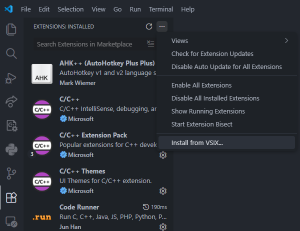

# Great Quest Script

Language support for Great Quest Script (`.gqs`) files, used by [FrogLord](https://github.com/Kneesnap/FrogLord) to modify *Frogger: The Great Quest*.

## Features

[Features.webm](https://github.com/user-attachments/assets/f1b94c1e-6878-4af2-9fcf-2ca2739ad52a)

* Syntax highlighting
* Autocomplete
* Folding sections and sticky headers so you can remember where you are
* Breadcrumbs for quick navigation
* Dialog hints: When using `OnDialog` and `ShowDialog`, see what the actual dialog is without having to scroll up to the dialog section. No more need to write comments on each line describing the dialog.
* Hover to see documentation
* Automatic generation of sequence hashes

## Extension Settings

* `greatQuestScript.inlineDialog`: Toggles whether to show dialog inline.
* `greatQuestScript.goToNextLineInSectionHeaders`: Whether to move the cursor to the next line when autocompleting section headers.
* `greatQuestScript.addSpaceAfterAutocomplete`: Whether to add a space after accepting certain autocompleted suggestions.
* `greatQuestScript.autogenerateHash`: Whether to automatically generate a random hash when autocompleting a sequence section header. This has no effect if `goToNextlineInSectionHeaders` is turned off.

## Installation

1. First, download the latest version of the extension from https://github.com/Eli-bassoon/great-quest-script-vscode/releases as a `.vsix` file

2. Click the extension button on the sidebar, then the three dots menu, then "Install from VSIX..."

   

3. Select the `.vsix` file you just downloaded.

Alternatively, install it from the command line using the following command, replacing `<VERSION>` with the actual version you downloaded.

```bash
code --install-extension great-quest-script-<VERSION>.vsix
```

## Release Notes

See [CHANGELOG.md](./CHANGELOG.md)
